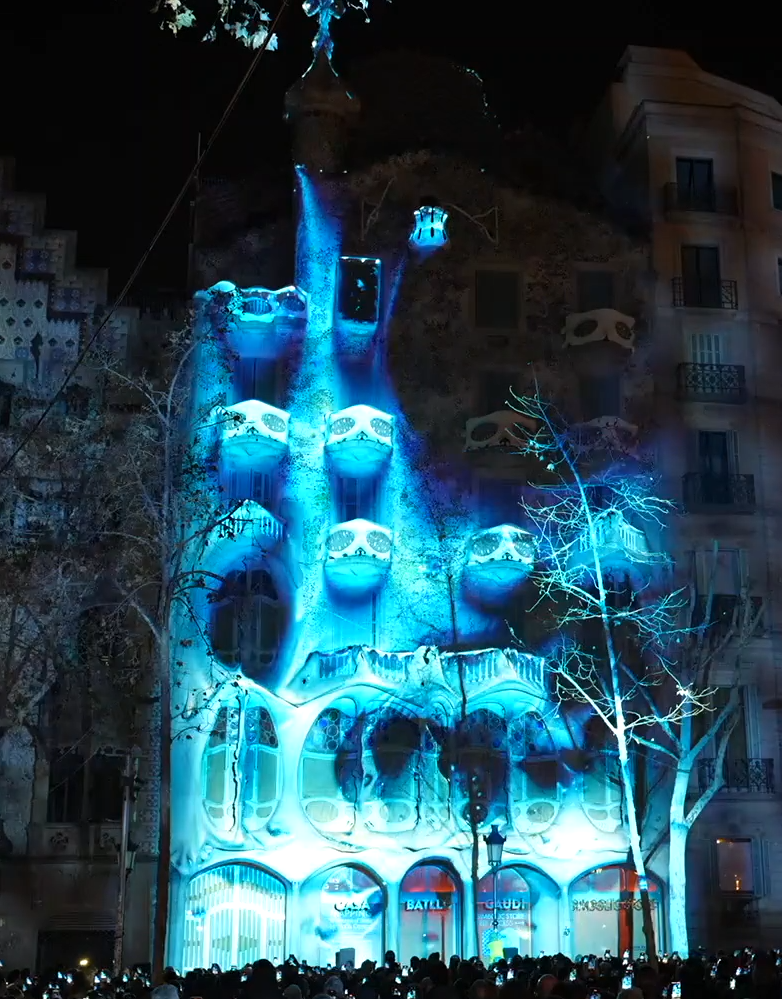

# Actividad 2.

## Ejemplo 1.
### Nombre: 
Kai-Hai: 塑 Plastia
### Artista:
Qianqian Ye
### URL:
https://vimeo.com/1046082953
### Descripcion:
es un viedorecreacion echa en arte generativa sobre el gran parche de basura. 
Es una serie en curso de instalaciones de realidad virtual y aumentada que utilizan el folclore transpacífico a la vez que remezclan narrativas ancestrales, personales y especulativas desde 
Polinesia hasta Asia Oriental para explorar cuestiones medioambientales, historias indígenas y de inmigrantes, y la diáspora a través del Océano Pacífico.
### Imagen:

### Resumen:
me llama la atencion de tanto por la narrativa ambiental que refleja como por la manera de creacion armonica que la compone, dicho trabajo me parece bastante interesante.

## Ejemplo 2.
### Nombre:
The Yell It Out Room
### Artista:
Kate Hollenbach
### URL:
https://www.katehollenbach.com/yell-it-out-room/
### Descripcion:
Yell It Out Room se diseñó para Supermajority, una organización sin ánimo de lucro que defiende los derechos de la mujer en la política y el voto. La «habitación» es un sitio web que crea un espacio lúdico para que el espectador grite su frustración. El proyecto se incluyó en un evento en línea que la organización celebró para promover el registro de votantes estadounidenses en septiembre de 2020.
### Imagen:

### Resumen:
ell It Out Room es una herramienta en línea creada para Supermajority, una organización dedicada a defender los derechos de las mujeres en la política y el voto. Esta página proporciona un espacio divertido y dinámico donde las personas pueden expresar su frustración de manera ruidosa. El proyecto formó parte de un evento virtual que la organización organizó en septiembre de 2020, con el propósito de fomentar el registro de votantes en Estados Unidos, brindando una experiencia que incentivara a la participación.

## Ejemplo 3.
### Nombre:
Structures of Being
### Artista:
Sofia Crespo
### URL:
https://sofiacrespo.com/structures-of-being/
### Descripcion:
es una exploración y articulación de las múltiples inspiraciones que se encuentran en la práctica de Antonio Gaudí y, en particular, en la Casa Batlló. En forma de mapping sobre la fachada del edificio, una serie de proyecciones tuvieron lugar los días 27 y 28 de enero de 2024. La intención de esta obra era crear una experiencia inmersiva que invitara a los espectadores a contemplar la profunda belleza de las formas naturales y su continua influencia en la creatividad humana.
### Imagen:

### Resumen:
Trabajo de Mapping en un edificio en Cataluña españa echa con arte generativo usando inteligencia artificia, dando un gran avance en la tecnologia y el arte en españa.
