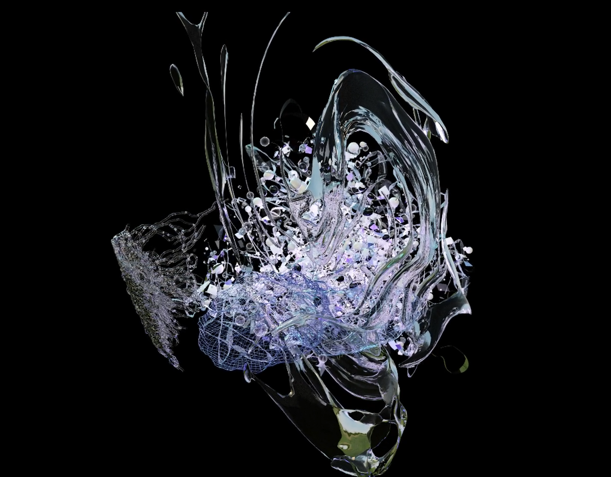
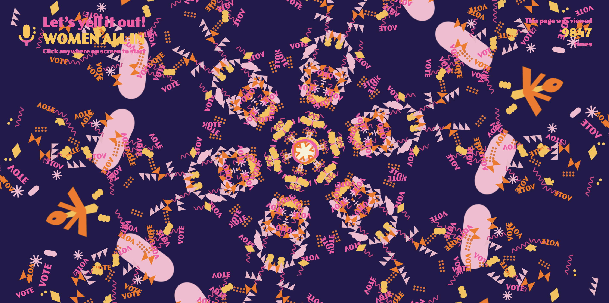

# Actividad 2.

## Ejemplo 1.
### Nombre: 
Kai-Hai: 塑 Plastia
### Artista:
Qianqian Ye
### URL:
https://vimeo.com/1046082953
### Descripcion:
es un viedorecreacion echa en arte generativa sobre el gran parche de basura. 
Es una serie en curso de instalaciones de realidad virtual y aumentada que utilizan el folclore transpacífico a la vez que remezclan narrativas ancestrales, personales y especulativas desde 
Polinesia hasta Asia Oriental para explorar cuestiones medioambientales, historias indígenas y de inmigrantes, y la diáspora a través del Océano Pacífico.
### Imagen:

### Resumen:
me llama la atencion de tanto por la narrativa ambiental que refleja como por la manera de creacion armonica que la compone, dicho trabajo me parece bastante interesante.

## Ejemplo 2.
### Nombre:
The Yell It Out Room
### Artista:
Kate Hollenbach
### URL:
https://www.katehollenbach.com/yell-it-out-room/
### Descripcion:
### Imagen:

### Resumen:

## Ejemplo 3.
### Nombre:
### Artista:
### URL:
### Descripcion:
### Imagen:
### Resumen:
